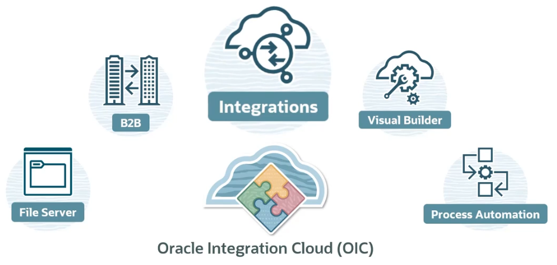

# Oracle Integration Cloud (OCI)

Oracle Integration Cloud (OCI) includes several features:
- Integrations
- Process Automation
- Visual Builder
- File Server
- B2B

## Oracle Integration Editions

- Standard ($)
    - Integrations
    - File Server
    - Visual Builder
- Enterprise ($$)
    - Standard Edition
    - B2B
    - RPA (Robotic Process Automation)
    - Enterprise Adapter
        - Oracle E-Business Suite
        - Oracle JD Edwards EnterpriseOne
        - Oracle Siebel
        - SAP
- Healthcare ($$$)
    - Enterprise Edition
    - HL7 Support