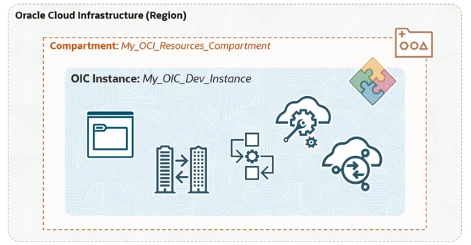
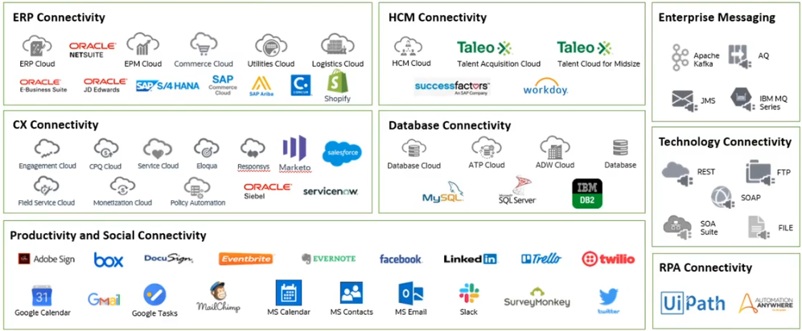

# Oracle Integration Cloud (OIC)

**Oracle Integration Cloud (OIC)** includes several features:
- Integrations
    - Connections
    - Lookups
    - Mappings
    - Integrations
    - Adapters
- Process Automation
- Visual Builder
- File Server
- B2B

## OIC Instance

An **OIC instance** is essentially a provisioned, operational environment of OIC. 

Within the scope of an OCI region identified within a compartment, each instance is isolated and configured for a specific organization or project.

An **OIC Integration** is a service that you define and configure and then deploy within your OIC instance. After integration is activated, it can then be triggered numerous times, perhaps even invoked by multiple concurrent clients. Once that happens, each time it is triggered, a new integration instance is spawned, which runs separately and is identified uniquely with its metadata persisted, so it can be tracked later on. 

## OIC Integrations Features

- Integrations
    - Integration Service
    - Business Service
    - Proxy Service
- Adapters (over 80 built-in)
    - Oracle Cloud SaaS Applications
    - Third-Party Cloud SaaS Applications
    - On-Premises Enterprise Apps
    - Social and Productivity Applications
    - Generic Technology Adapters 
- Connections
    - Based on a specific adapter
    - Includes connectivity & security properties
- (Connectivity) Agents
    - Facilitate connectivity with external services or applications located in a private network
- Lookups
    - Domain value maps (Country code, city code, etc.)
    - Work much like a database table
- Libraries
    - Custom functions written in Javascript
- Events
    - Internal OIC events support a publish-subscribe pattern for the decoupling of certain integrations
- Packages
    - Group one or more integrations into a package

## OIC Editions

- Standard ($)
    - Integrations
    - File Server
    - Visual Builder
- Enterprise ($$)
    - Standard Edition
    - B2B
    - RPA (Robotic Process Automation)
    - Enterprise Adapter
        - Oracle E-Business Suite
        - Oracle JD Edwards EnterpriseOne
        - Oracle Siebel
        - SAP
- Healthcare ($$$)
    - Enterprise Edition
    - HL7 Support