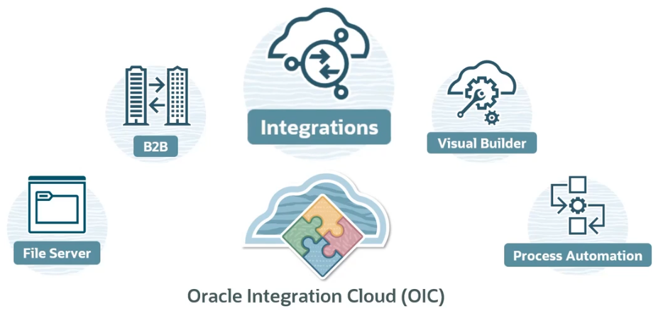

# Oracle Integration Cloud (OIC)

**Oracle Integration Cloud (OIC)** includes several features:
- Integrations
    - Connections
    - Lookups
    - Mappings
    - Integrations
    - Adapters
- Process Automation
- Visual Builder
- File Server
- B2B

**Note.** API Gateway is NOT one of the features provided within OIC. However, API Gateway IS available as a separate Oracle Cloud Infrastructure (OCI) service that can be used in conjunction with OIC.

## OIC Instance

An **OIC instance** is essentially a provisioned, operational environment of OIC. 

Within the scope of an OCI region identified within a compartment, each instance is isolated and configured for a specific organization or project.

An **OIC Integration** is a service that you define and configure and then deploy within your OIC instance. After integration is activated, it can then be triggered numerous times, perhaps even invoked by multiple concurrent clients. Once that happens, each time it is triggered, a new integration instance is spawned, which runs separately and is identified uniquely with its metadata persisted, so it can be tracked later on. 

## OIC Editions

- Standard ($)
    - Integrations
    - File Server
    - Visual Builder
- Enterprise ($$)
    - Standard Edition
    - B2B
    - RPA (Robotic Process Automation)
    - Enterprise Adapter
        - Oracle E-Business Suite
        - Oracle JD Edwards EnterpriseOne
        - Oracle Siebel
        - SAP
- Healthcare ($$$)
    - Enterprise Edition
    - HL7 Support